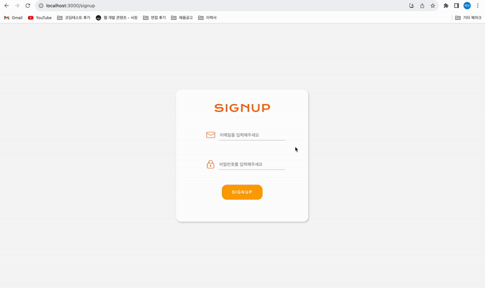
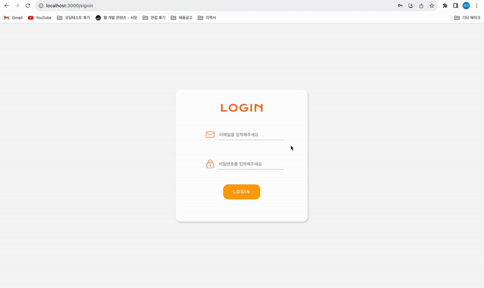
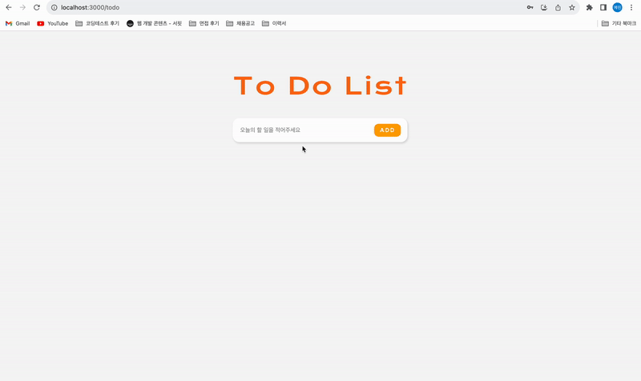
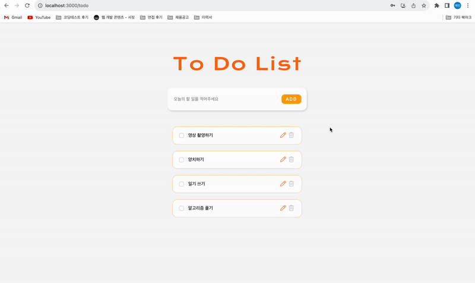
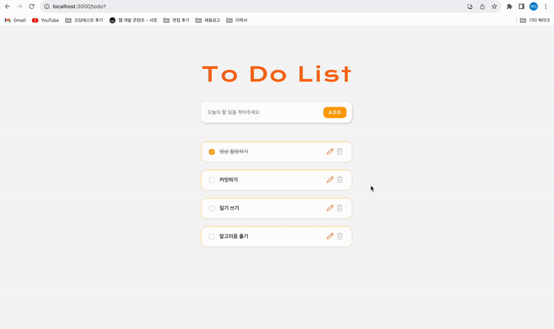

# wanted-pre-onboarding-frontend
 

## 이름
#### 김예린
 

# 프로젝트 실행 방법
1. `npm install` 및 `npm start`를 실행해주세요.
2. `localhost:3000/signup` 경로로 접속해주세요.
3. 회원가입 및 로그인을 진행해주세요.

 

# 데모 영상

🎥 고화질의 영상을 보고싶으시다면 [이곳](https://github.com/ererink/wanted-pre-onboarding-frontend/issues)을 눌러주세요!
 

## 1. 회원가입

## 2. 로그인

## 3. To Do List

### 3-1. To-do 추가

### 3-2. To-do 완료 처리 및 수정

### 3-3. To-do 삭제

